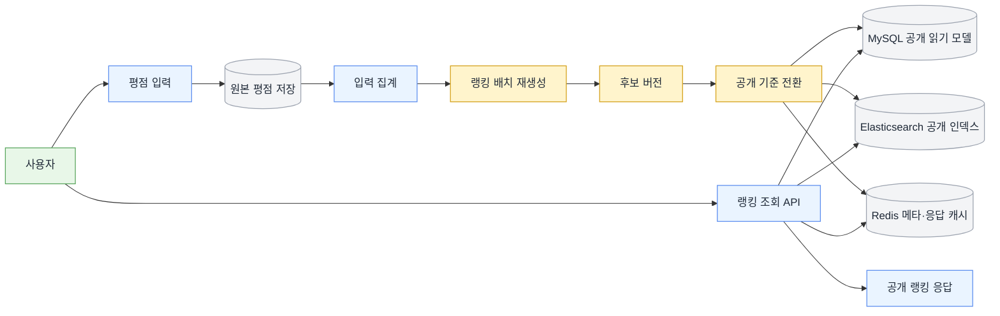
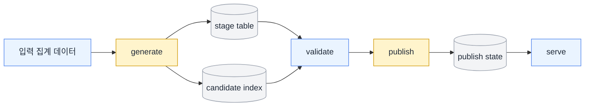
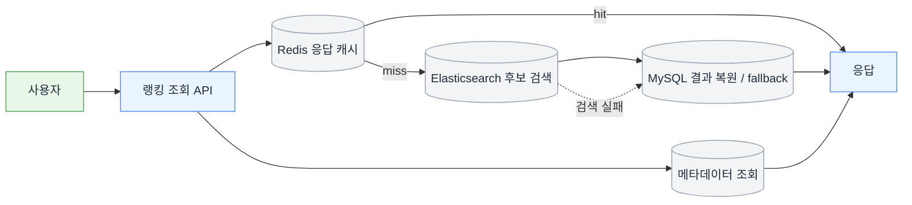

# Hipster

사용자 평점 데이터를 집계해 음악 차트를 생성하고 공개하는 백엔드 프로젝트입니다.

차트는 단순한 목록이 아니라, 사용자가 장르·디스크립터·언어·발매연도 같은 조건으로 음악을 탐색하는 진입점입니다. 그래서 필터 조합이 많아져도 빠르게 조회되어야 하고, 집계가 갱신되는 순간에도 저장소마다 다른 버전의 결과가 섞여 보이지 않아야 합니다.
이 프로젝트에서는 이런 요구를 **다중값 필터 조회 병목**, **다중 저장소 간 공개 일관성**, **스냅샷 기반 배치 재생성 비용**이라는 백엔드 문제로 바꿔 설계하고 구현했습니다.

## 해결한 문제

* **다중값 필터 조회 병목**
  projection과 인덱스 최적화로 JOIN 비용과 단일값 필터 비용은 줄일 수 있었지만, JSON 컬럼 기반 다중값 필터는 MySQL만으로 후보 축소와 정렬을 동시에 처리하기 어려웠습니다.
  그래서 **Elasticsearch를 검색 계층으로 분리하고, MySQL은 결과 복원 / fallback에 남기는 구조**로 조회 경로를 다시 나눴습니다.

* **다중 저장소 간 공개 일관성**
  배치 결과를 MySQL, Elasticsearch, Redis에 순차 반영하면 저장소마다 다른 버전이 노출될 수 있습니다.
  **`current_version` 기반 공개 기준**을 두고, **generate → validate → publish → serve** 파이프라인으로 공개 전환을 제어했습니다.

* **스냅샷 기반 배치 재생성 비용**
  스냅샷을 새로 계산해 교체하는 배치는 UPSERT, 재색인, 메타데이터 조회 비용이 누적되면 전체 처리 시간이 급격히 늘어납니다.
  writer 병목을 **metadata fetch / serialization / db write**로 분해하고, **stage insert + table swap**, **JDBC + keyset**으로 재생성 경로를 최적화했습니다.

## 성과

> 모든 수치는 500만 건 합성 데이터 기준 로컬 환경에서 측정했습니다.

| 항목                      |   Before |   After |
| ----------------------- | -------: | ------: |
| 필터 기반 차트 조회 (캐시 미스 경로)  | 65,421ms |   178ms |
| 반복 요청 (캐시 적중 경로)        | 11,386ms |    17ms |
| 메타데이터(`lastUpdated`) 조회 |  4,732ms |     1ms |
| Projection writer 처리 시간 |  약 87.9분 | 약 23.9분 |
| 전체 재생성(`full rebuild`)  |        — | 약 11.8분 |

## 상세 문서

* [차트 API 조회 경로를 캐시·검색·폴백·메타데이터로 분리해 응답 병목 줄이기](./portfolio/chart-serving.md)
* [차트 공개 정합성을 위해 공개 파이프라인 다시 세우기](./portfolio/chart-pipeline.md)
* [차트 재생성 배치 비용 줄이기](./portfolio/chart-batch-performance.md)

## 기술 키워드

Java 17 · Spring Boot 3.2 · MySQL · Redis · Elasticsearch · Spring Batch · RabbitMQ · Prometheus

---

## 설계 요약
    
* **다중값 필터 조회 병목**: Redis look-aside cache → Elasticsearch 후보 검색 → MySQL 결과 복원 / fallback
* **다중 저장소 간 공개 일관성**: `current_version` 기반 공개 기준과 `generate → validate → publish → serve` 파이프라인
* **스냅샷 기반 배치 재생성 비용**: stage insert + table swap, `metadata fetch / serialization / db write` 병목 분해, `JDBC + keyset` 기반 재색인 최적화

---

## 핵심 설계

### 1. MySQL 최적화의 한계를 확인하고 조회 계층을 분리했습니다

차트 조회 경로에서 먼저 줄여야 했던 비용은 **조회 시점의 JOIN**과 **다중값 필터 평가 비용**이었습니다.
처음에는 릴리즈·장르·디스크립터를 요청마다 JOIN했습니다. 이후 `chart_scores`에 `genreIds`, `descriptorIds`, `languages`를 JSON 형태로 함께 저장하는 projection 구조로 바꾸면서, 조회 시점의 조인 비용을 배치 시점으로 옮겼습니다.

projection 전환 뒤에는 JOIN 관련 읽기 비용이 크게 줄었습니다.

* 장르 단일 필터 기준, `Handler_read_key`: **1,592만 → 67**

하지만 병목이 사라진 것은 아니었습니다. `Handler_read_rnd_next`는 여전히 **1,000만 수준**에 머물렀고, 넓게 읽은 뒤 `JSON_CONTAINS`를 평가하고 정렬하는 경로가 그대로 남아 있었습니다.

그래서 MySQL 안에서 더 줄일 수 있는지도 먼저 확인했습니다. `releaseType`, `releaseYear`, `locationId`, `bayesian_score` 조합으로 조회 경로와 인덱스를 정리하자 단일값 필터는 더 빨라졌습니다.

* `releaseType=ALBUM`: **8,864ms → 7,159ms**

반면 JSON 컬럼 필터가 걸리는 시나리오에서는 효과가 거의 없었습니다.

* `genreIds=[1]`: **12,034ms → 11,564ms**
* `genreIds=[1,7]`: **14,089ms → 13,773ms**

단일값 필터(`releaseType`, `releaseYear`)는 B-Tree 인덱스 효과를 볼 수 있었지만, 장르처럼 JSON 배열을 탐색하는 조건에서는 후보를 충분히 줄이지 못했고 `Using filesort`도 사라지지 않았습니다. 즉, MySQL만으로는 다중값 필터를 기본 조회 경로로 쓰기 어려웠습니다.

그래서 조회 경로를 저장소별 역할에 맞게 나눴습니다.

* **Redis**: 최종 응답 전체를 look-aside 캐시
* **Elasticsearch**: 다중값 필터 조건으로 릴리즈 ID 후보 축소
* **MySQL**: 후보 ID 기반 최종 결과 복원, 검색 장애 시 fallback
* **메타데이터(`lastUpdated`) 분리**: 별도 Redis 키로 관리해 고정 비용 제거

역할도 명확히 나눴습니다. MySQL은 단일값 조건과 정렬, Elasticsearch는 다중값 필터 검색을 맡도록 했습니다.
이 API는 read-heavy이고 비용이 DB 한 번이 아니라 검색 → hydrate → 응답 조립 전체에 퍼져 있었기 때문에, 부분 캐시보다 최종 응답 캐시가 더 효과적이었습니다.

캐시 키는 `chart:v1:{publishedVersion}:...` 형태로 구성했습니다. 공개 전환 이후 이전 응답이 섞이지 않도록, 캐시도 같은 공개 버전 기준을 따르도록 했습니다.

Elasticsearch를 붙인 뒤에도 응답은 한동안 4~5초대였습니다. 검색 단계는 빨라졌지만, 다른 공통 비용이 남아 있었습니다.

* 장르 단일 필터 기준, 검색 단계: **37ms**
* 같은 요청의 `lastUpdated` 조회: **4,732ms**

요청마다 `chart_scores`에서 최신 갱신 시각을 다시 읽고 있었고, 이 고정 비용이 전체 응답 시간을 끌어올리고 있었습니다.
`lastUpdated`를 별도 Redis 메타데이터 키로 분리하고 배치 완료 시점에만 갱신하도록 바꾼 뒤, 장르 단일 필터 기준 캐시 미스 경로는 **178ms**까지 내려왔습니다.

* 필터 기반 차트 조회(캐시 미스 경로): **65,421ms → 178ms**
* 반복 요청(캐시 적중 경로): **11,386ms → 17ms**
* 메타데이터(`lastUpdated`) 조회: **4,732ms → 1ms**

→ 자세한 내용은 [차트 API 조회 경로를 캐시·검색·폴백·메타데이터로 분리해 응답 병목 줄이기](./portfolio/chart-serving.md)에서 다뤘습니다.

### 2. 배치 완료와 공개 전환을 분리했습니다

차트에서는 성능만큼 공개 시점의 일관성이 중요했습니다.
배치가 끝난 직후 결과를 바로 노출하면 MySQL·Elasticsearch·Redis가 서로 다른 타이밍에 갱신되면서 저장소마다 다른 버전의 차트가 보일 수 있습니다. `lastUpdated`만 먼저 바뀌면, 갱신된 것처럼 보이지만 실제 결과는 이전 버전인 상태가 됩니다.

공개 기준은 `chart_publish_state.current_version` 단일 레코드로 고정했습니다.
후보 생성과 공개 전환도 분리했습니다.

```text
generate → validate → publish → serve
```

각 단계의 역할은 다음과 같습니다.

* **generate**: 새 차트 스냅샷과 검색 후보 생성
* **validate**: MySQL 후보 행 수와 Elasticsearch 후보 문서 수 교차 검증
* **publish**: MySQL 공개 테이블 교체, Elasticsearch alias 전환, Redis 캐시 무효화, `lastUpdated` 갱신
* **serve**: 모든 저장소가 같은 `current_version` 기준으로 응답

배치가 끝났다고 바로 공개하지 않았습니다. 검증을 통과한 결과만 공개 버전으로 전환했습니다.
행 수와 문서 수가 맞지 않으면 `current_version`을 바꾸지 않았고, 공개가 늦어지더라도 덜 만들어진 결과를 먼저 노출하지 않도록 했습니다.

공개 실패가 나더라도 `current_version`을 이전 값으로 유지하거나 되돌리면, MySQL·Elasticsearch·Redis가 모두 같은 이전 버전을 바라보도록 복구할 수 있습니다.
`lastUpdated`도 배치 완료 시각이 아니라, 현재 공개된 차트가 어느 시점의 데이터를 반영하는지 설명하는 값으로 다뤘습니다.

→ 자세한 내용은 [차트 공개 정합성을 위해 공개 파이프라인 다시 세우기](./portfolio/chart-pipeline.md)에서 다뤘습니다.

### 3. 차트 재생성 배치를 다시 설계했습니다

차트는 기존 데이터를 조금씩 수정하기보다, 새 스냅샷을 다시 계산하고 공개하는 성격이 강합니다.
재생성 배치의 writer 병목도 단순히 DB write 문제로 보지 않고, 실제 비용이 어디서 발생하는지 단계별로 나눠 측정했습니다.

writer를 `metadata fetch`, `serialization`, `db write`로 나눠 본 결과, 병목은 DB write보다 앞단에 더 크게 몰려 있었습니다.

* `metadata fetch`: **935ms → 128ms**
* `serialization`: **53ms → 1ms 미만**
* 청크당 total: **2,109ms → 573ms**

쓰기 전략도 본 테이블 UPSERT 대신 **stage insert + table swap**으로 바꿨습니다.
차트는 새 버전을 만들어 공개하는 구조이기 때문에, 기존 행 확인과 인덱스 갱신 비용을 반복하는 UPSERT보다 빈 stage 테이블에 먼저 적재한 뒤 공개 시점에 교체하는 방식이 더 잘 맞았습니다.
대신 stage 공간이 더 필요하고, 공개 전환 단계가 하나 더 필요합니다.

* 본 테이블 UPSERT 평균 DB write: **592ms**
* stage insert 평균 DB write: **298ms**

Elasticsearch 재색인도 같은 방식으로 병목 위치를 다시 확인했습니다.
bulk index 자체보다 source fetch가 더 큰 비용이었고, JPA 기반 페이지 접근을 `JDBC + keyset`으로 바꾼 뒤에야 fetch 비용을 크게 줄일 수 있었습니다.

* Elasticsearch source fetch: **6,854ms → 44ms**
* Elasticsearch bulk index: **572ms → 806ms**
* 전체 재생성(`full rebuild`): **약 11.8분**

fetch 비용이 줄어든 뒤에는 bulk index 단계가 새로운 병목으로 드러났습니다.
병목을 한 번에 해결한 것이 아니라, 앞단 비용을 줄여 다음 병목을 드러내는 식으로 재생성 경로를 계속 다듬었습니다. fetch 비용을 줄인 뒤에야 bulk index가 실제 최적화 대상으로 보이기 시작했습니다.

→ 자세한 내용은 [차트 재생성 배치 비용 줄이기](./portfolio/chart-batch-performance.md)에서 다뤘습니다.

## 대표 API

`GET /charts`는 상위 몇 개를 고정해서 보여주는 목록 조회보다, 정렬된 필터 결과를 빠르게 보여주는 차트 조회 API에 가깝습니다. 다중 필터 검색과 공개 버전 일관성을 함께 만족해야 합니다.

* 예시 필터: 장르, 디스크립터, 언어, 발매연도
* 조회 흐름: Redis 응답 캐시 → Elasticsearch 후보 검색 → MySQL 결과 복원 / fallback
* 응답 특징: 공개된 `current_version` 기준의 차트 결과와 메타데이터 반환

## 핵심 데이터 모델

차트 구조를 이해하려면 `chart_publish_state`와 `chart_scores` 두 모델을 먼저 보면 됩니다.

### `chart_publish_state`

차트 공개 기준을 하나의 레코드로 관리합니다.

* `current_version`: 현재 공개 중인 버전
* `previous_version`: 직전 공개 버전
* `candidate_version`: 검증 및 공개 대기 중인 후보 버전

이 레코드를 기준으로 MySQL 공개 읽기 모델, Elasticsearch 공개 인덱스, Redis 캐시가 같은 버전을 바라보도록 맞췄습니다.

### `chart_scores`

차트 조회용 읽기 모델입니다.

* projection 형태로 필터/정렬에 필요한 값을 미리 반영
* 다중값 필터 후보 축소는 Elasticsearch가 담당
* MySQL은 최종 결과 복원과 fallback 담당

이 프로젝트의 데이터 모델은 정규화된 원본 저장보다, 공개 가능한 스냅샷과 빠른 조회를 위한 읽기 모델에 더 초점을 맞췄습니다.

## 검증

공개 전환과 rollback 경로는 통합 테스트로 검증했습니다.

* **publish end-to-end 테스트**

  * 새 후보 생성부터 검증, 공개, 응답 기준 전환까지 검증
* **rollback / failure path 테스트**

  * 공개 실패 시 이전 버전 기준으로 안전하게 복귀하는 흐름 검증
* **공개 기준 검증**

  * 공개 안정화 후 Redis published version, Elasticsearch alias, DB publish state, API 응답이 같은 version과 `logical_as_of_at`를 가리키는지 확인
* **Testcontainers 기반 통합 테스트**

  * MySQL, Redis, RabbitMQ, Elasticsearch 연동 환경에서 주요 시나리오 재현

## 기타 구현

차트 외의 영역에서는 비동기 처리와 복구 흐름도 구현했습니다.

* **rating async architecture**: 평점 원본 쓰기와 집계 읽기 모델 분리, 비동기 흐름과 복구 경로 설계
* **reward outbox**: outbox + idempotency로 적립 흐름의 중복 처리와 신뢰성 보강
* **settlement state machine**: webhook inbox와 reconciliation 흐름으로 지연·중복·실패 이벤트 처리
* **moderation workflow**: 운영자 처리 흐름과 backlog / SLA 관측 포인트를 둘 수 있는 구조

## 운영 관측

* **Prometheus + Actuator 기반 메트릭 수집 환경 구성**
* **API 실행 시간 / DB 쿼리 수 로깅**
* **request id 기반 MDC 로깅으로 추적성 확보**
* **차트 API 지연 시간, 캐시 hit ratio, fallback 비율은 추후 운영/부하 테스트 기준으로 보강 예정**

## 기술 스택

* **Backend**: Java 17, Spring Boot 3.2.3, Spring Data JPA, Querydsl, Spring Batch
* **Storage / Search / Cache**: MySQL, Elasticsearch, Redis
* **Messaging**: RabbitMQ
* **Observability**: Prometheus, Grafana
* **Environment**: Docker

---

<details>
<summary>아키텍처 다이어그램 보기</summary>

### 전체 흐름



### 공개 파이프라인



### 조회 경로



</details>
