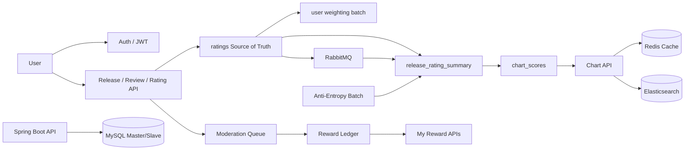

# Hipster

커뮤니티가 직접 음악 카탈로그를 만들고 평가하는 음악 리뷰 플랫폼 백엔드입니다.  
사용자는 릴리즈를 제안하고, 평점과 리뷰를 남기고, 가중치 기반 차트를 탐색할 수 있습니다. 운영자는 moderation queue로 카탈로그 품질을 관리하고, 승인된 기여는 reward ledger에 기록됩니다.

이 저장소는 단순 CRUD API 모음이 아니라, 읽기 모델, 중간 집계, 배치, 운영형 큐, 원장 구조를 어떻게 설계하고 검증했는지를 보여주는 포트폴리오형 프로젝트입니다. 별도 포트폴리오를 첨부하지 않아도 README만으로 프로젝트의 핵심 문제와 해결 방향을 이해할 수 있도록 정리했습니다.

## 한눈에 보기

- 서비스 성격: 커뮤니티 큐레이션 음악 카탈로그 및 리뷰 플랫폼
- 핵심 사용자 흐름: 회원가입 -> 릴리즈 탐색/제안 -> 평점/리뷰 작성 -> 차트 조회
- 핵심 운영 흐름: moderation queue -> 승인/반려 -> 승인 기여 reward 적립
- 포트폴리오 포인트: 성능 튜닝 자체보다 `책임 경계`, `운영 설명 가능성`, `정합성`, `측정 기반 의사결정`

## 이 프로젝트가 다루는 문제

음악 카탈로그 서비스는 겉보기보다 데이터 흐름이 복잡합니다.

- 평점은 단순 합계가 아니라 유저 신뢰도 정책의 영향을 받습니다.
- 차트는 읽기 트래픽이 높고, 필터 조합이 많아 원본 테이블 직접 조회만으로는 한계가 빨리 옵니다.
- 사용자 기여형 카탈로그는 moderation이 없으면 데이터 품질을 유지하기 어렵습니다.
- 기여 보상은 단순 포인트 적립이 아니라, 중복 방지와 취소 이력까지 설명 가능한 원장 구조가 필요합니다.

Hipster는 이 문제들을 각각 따로 최적화한 프로젝트가 아니라, 하나의 서비스 안에서 연결된 경계로 풀어낸 기록입니다.

## 서비스 핵심 흐름



## 핵심 기능

### 사용자 기능

- JWT 기반 회원가입, 로그인, 토큰 재발급
- 릴리즈, 아티스트, 장르, 트랙 조회 및 등록
- 릴리즈 평점 등록/수정/삭제
- 리뷰 작성, 수정, 삭제, 공개 전환
- 가중치 기반 차트 조회
- 내 프로필, 비밀번호, 회원 탈퇴 관리
- 내 reward 적립 내역 및 잔액 조회

### 운영 기능

- moderation queue 조회
- claim / unclaim / reassign
- approve / reject
- SLA, backlog, audit trail, metrics 기반 운영성 강화

## 포트폴리오 하이라이트

| 주제 | 해결한 핵심 문제 | 설계 포인트 | 대표 결과 | 깊이 읽기 |
| --- | --- | --- | --- | --- |
| 유저 신뢰도 계층 | 느린 정책 변화가 과거 평점 row 재기록으로 번지는 문제 | write amplification 제거, SQL 집계, chunk processing, 설명 가능한 배치 통계 | `10,420ms -> 1,138ms`, `921,000ms -> 359,200ms` | [study pack](docs/portfolio/user_weighting/study_pack/concepts_learning_interview.md) / [main doc](docs/portfolio/user_weighting/weting_cacl_batch_v4.md) |
| 평점 집계 계층 | 원본 전수 계산과 쓰기 경합이 함께 커지는 구조 | source of truth와 derived aggregate 분리, RabbitMQ, anti-entropy | 조회 `806ms -> 20ms`, 쓰기 `126ms -> 12.95ms` | [study pack](docs/portfolio/rating/study_pack/concepts_learning_interview.md) / [main doc](docs/portfolio/rating/rating_performance_improvement_v4.md) |
| 차트 서빙 계층 | 필터 많은 랭킹 조회의 JOIN 병목 | read model, Redis cache, Elasticsearch, metadata 분리 | `65,442ms -> 12,069ms`, ES miss `4,790ms -> 146ms` | [study pack](docs/portfolio/chart_read/study_pack/concepts_learning_interview.md) / [main doc](docs/portfolio/chart_read/chart_v4.md) |
| 차트 재생성·공개 | 빠른 조회 뒤에 숨어 있던 rebuild/publish 비용 | writer decomposition, stage snapshot, versioned publish | rough estimate `40.4분`, full rebuild baseline `11.8분`, publish visibility `296ms` | [study pack](docs/portfolio/chart_batch/study_pack/concepts_learning_interview.md) / [main doc](docs/portfolio/chart_batch/chart_batch_v1.md) |
| Moderation 운영형 큐 | 검수 기능은 있지만 운영 가능한 backlog가 아닌 문제 | lease lifecycle, timeout recovery, reassign, audit trail, SLA, metrics | `24시간 SLA`, backlog visibility, 시나리오 테스트 | [study pack](docs/portfolio/moderation/study_pack/concepts_learning_interview.md) / [case study](docs/portfolio/moderation/mod_x001_case_study.md) |
| Reward Ledger | 승인 결과를 적립 가능한 입력으로 해석하는 경계 부재 | authority boundary, idempotency, ledger, reversal, `/me` 조회 | 승인 단위 적립, 정책 차단, reversal, 사용자 자기 조회 | [study pack](docs/portfolio/reward_ledger/study_pack/concepts_learning_interview.md) / [case study](docs/portfolio/reward_ledger/final_outputs/rwd_x001_case_study.md) |

> 위 성능 수치는 `docs/portfolio`에 정리한 로컬 benchmark 및 실험 결과 기준입니다. 운영 환경 수치로 과장하지 않고, 구조 선택의 근거로 사용했습니다.

## 설계 원칙

### 1. Source of Truth와 Projection을 분리했습니다

원본 데이터를 직접 읽어서 모든 요구를 해결하기보다, 책임이 달라지는 시점에 projection과 중간 집계를 분리했습니다.

- `ratings` -> `release_rating_summary`
- `release_rating_summary` -> `chart_scores`
- reward balance -> reward ledger aggregation

### 2. Write Amplification을 피했습니다

느린 정책 변화나 복잡한 조회 요구를 원본 row 재기록으로 풀지 않도록 설계를 바꿨습니다.  
이 방향은 유저 신뢰도 배치, 평점 집계, 차트 계층 전반에 공통으로 반영돼 있습니다.

### 3. Eventual Consistency를 쓸 때는 Repair Path까지 같이 설계했습니다

비동기를 도입하는 것만으로 끝내지 않고, 왜 해당 경계는 eventual consistency가 맞는지, 그리고 어긋남이 생기면 무엇으로 수복할지를 함께 설명할 수 있게 만들었습니다.

- rating: `AFTER_COMMIT + RabbitMQ + Anti-Entropy`
- chart: snapshot rebuild + publish correctness
- reward: correctness 중심 경계를 먼저 닫고, failure isolation은 다음 단계로 분리

### 4. 운영자가 설명할 수 있는 구조를 우선했습니다

단순히 “동작한다”보다 “왜 지금 상태가 되었는지 설명 가능해야 한다”를 중요하게 봤습니다.

- moderation의 audit trail, SLA, backlog metrics
- reward의 ledger, blocked entry, reversal
- weighting의 `user_weight_stats`

### 5. 감이 아니라 측정으로 의사결정했습니다

각 구조 변경은 benchmark, 테스트, 실행 로그, 설계 문서로 남겼습니다.  
이 프로젝트의 포인트는 “최적화를 해봤다”가 아니라 “무엇을 포기하고 무엇을 얻었는지 수치와 트레이드오프로 설명할 수 있다”는 점입니다.

## 기술 스택

### Backend

- Java 17
- Spring Boot 3.2.3
- Spring Web, Validation, Data JPA
- Querydsl
- Spring Batch
- Spring AMQP
- MapStruct
- JWT

### Data & Infra

- MySQL 8.0 (master / slave)
- Redis
- Elasticsearch
- RabbitMQ
- Prometheus
- Grafana
- Docker Compose

### Test

- JUnit 5
- Spring Boot Test
- Testcontainers

## 실행 방법

### 1. 인프라 실행

```bash
docker compose up -d
```

기본 구성은 아래 서비스를 함께 올립니다.

- MySQL master: `3306`
- MySQL slave: `3307`
- Redis: `6379`
- RabbitMQ: `5672`, management UI `15672`
- Elasticsearch: `9200`
- Prometheus: `9090`
- Grafana: `3000`

### 2. 애플리케이션 실행

```bash
./gradlew bootRun
```

기본 프로필은 `local`입니다.

### 3. 테스트 실행

```bash
./gradlew test
```

### 4. 주요 진입점

- API base URL: `http://localhost:8080/api/v1`
- OpenAPI 문서: [docs/api/API_Specification.yaml](docs/api/API_Specification.yaml)
- Prometheus: `http://localhost:9090`
- Grafana: `http://localhost:3000`
- RabbitMQ Management: `http://localhost:15672`

## 문서 가이드

README만 읽어도 프로젝트의 큰 그림은 이해할 수 있지만, 더 깊게 보려면 아래 문서 순서를 추천합니다.

### 프로젝트 이해

1. [서비스 개요와 유저 스토리](docs/service_user_story.md)
2. [프로젝트 구조 명세서](docs/프로젝트_구조_명세서.md)
3. [포트폴리오 종합 학습 가이드](docs/portfolio/study_pack/portfolio_integrated_study_guide.md)

### 데이터/집계 흐름

1. [유저 신뢰도 계층](docs/portfolio/user_weighting/study_pack/concepts_learning_interview.md)
2. [평점 집계 계층](docs/portfolio/rating/study_pack/concepts_learning_interview.md)
3. [차트 서빙 계층](docs/portfolio/chart_read/study_pack/concepts_learning_interview.md)
4. [차트 재생성·공개 파이프라인](docs/portfolio/chart_batch/study_pack/concepts_learning_interview.md)

### 운영/경계 흐름

1. [Moderation 운영형 큐](docs/portfolio/moderation/study_pack/concepts_learning_interview.md)
2. [Reward Ledger](docs/portfolio/reward_ledger/study_pack/concepts_learning_interview.md)

## 현재 기준에서 솔직하게 말할 것

포트폴리오로서 신뢰도를 높이기 위해, 현재 범위에서 의도적으로 남겨둔 한계도 함께 드러냅니다.

- weighting은 아직 일부 correctness 이슈가 남아 있습니다.
- rating은 exact-once가 아니라 eventual consistency + anti-entropy 기반 수복 구조입니다.
- chart benchmark 수치는 운영 수치가 아니라 로컬 synthetic 실험값입니다.
- moderation은 운영형 queue의 1차 기반이지, 완성형 trust & safety platform 전체는 아닙니다.
- reward는 correctness 중심의 1차 원장이며, failure isolation과 scale-out은 후속 과제입니다.

## 프로젝트가 보여주고 싶은 역량

이 프로젝트는 “기능을 많이 만들었다”보다 아래 역량을 보여주는 데 초점을 맞췄습니다.

- 도메인 책임을 기준으로 경계를 나누는 설계력
- 정합성과 운영 비용을 함께 보는 백엔드 사고
- 비동기, 배치, 캐시, 검색 엔진을 문제 맥락에 맞게 선택하는 판단력
- 측정과 테스트로 개선 근거를 남기는 습관
- 남겨둔 한계까지 포함해 시스템을 솔직하게 설명하는 태도
