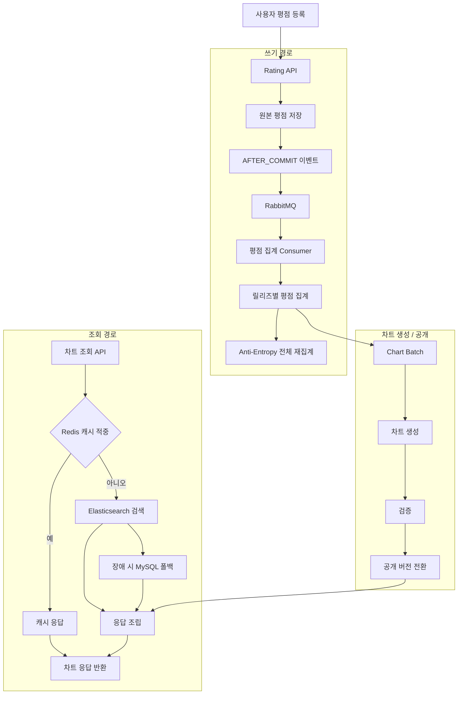
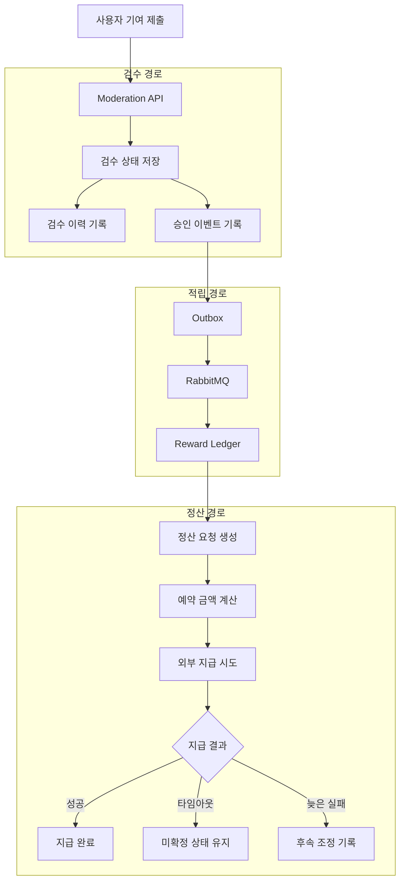

# Hipster

커뮤니티 기반 음악 평가 및 차트 플랫폼 백엔드

> 사용자 기여로 카탈로그를 쌓고, 가중 평점으로 차트를 만드는 시스템입니다.  
> 집계 정합성, 공개 일관성, 보상 추적 가능성을 기능별로 분리해 설계하고 구현했습니다.

---

## 기술 스택

Java · Spring Boot · Spring Batch · Spring Data JPA · MySQL · Redis · RabbitMQ · Elasticsearch · Prometheus · Grafana

---

## 시스템 구조

### 평점과 차트 흐름

### 검수와 보상 흐름

---

## 핵심 구현 문서

### 1. [평점 집계 계층을 분리하고 결과적 일관성으로 수렴시키기](./portfolio/rating-aggregation.md)

- **문제:** 평균 평점 조회와 가중치 반영이 같은 경로에 묶여 있어, 조회가 느려지고 가중치 변경이 과거 평점 재기록으로 번졌습니다.
- **해결:** 원본 평점 저장과 집계 갱신을 분리하고, 집계는 비동기 반영과 전체 재집계 보정으로 수렴시키도록 바꿨습니다.
- **결과:** 평점 저장은 원본 반영까지만 직접 책임지고, 조회와 차트가 읽는 집계 결과는 후행 경로로 분리했습니다. 릴리즈 조회 응답은 `806ms -> 20ms`, 동시 100건 등록 평균 응답은 `126ms -> 12.95ms`로 줄었습니다.

---

### 2. [유저 가중치 변경이 만드는 쓰기 증폭을 줄이기 위한 구조 재설계](./portfolio/user-credibility-batch.md)

- **문제:** 유저 통계를 애플리케이션 메모리로 전부 계산하고, 가중치 변경이 과거 평점 재기록으로 번지면서 배치 비용이 커졌습니다.
- **해결:** 통계 계산을 SQL 집계로 바꾸고, 전체 처리는 Spring Batch 청크 배치로 재구성했으며, 가중치 변경의 직접 쓰기 범위를 다시 잘랐습니다.
- **결과:** 가중치 변경이 과거 평점 재기록으로 번지지 않게 직접 쓰기 범위를 좁혔고, 전체 배치도 재시작 가능한 구조로 바꿨습니다. 유저 통계 계산은 `10,420ms -> 1,138ms`, 전체 배치는 `921,000ms -> 359,200ms`로 줄었고 힙 변동도 `512MB 이상 -> 10MB 미만`으로 낮췄습니다.

---

### 3. [차트 공개 기준점을 세워 공개 지표 신뢰도 지키기](./portfolio/chart-pipeline.md)

- **문제:** 배치가 끝났더라도 검색, 캐시, API 응답이 서로 다른 버전을 보여주면 사용자가 같은 차트를 보고 있다고 말할 수 없었습니다.
- **해결:** 차트 생성, 검증, 공개, 서빙 단계를 분리하고, 공개 시점에는 모든 응답 경로가 같은 기준 버전을 따르도록 재구성했습니다.
- **결과:** 공개 실패와 롤백 경계를 분리했고, 공개 이후 캐시·검색·API 응답이 같은 버전을 가리키도록 맞췄습니다.

---

### 4. [차트 API 조회 경로를 캐시·검색·폴백·메타데이터로 분리해 응답 병목 줄이기](./portfolio/chart-serving.md)

- **문제:** 조인 비용, JSON 다중값 필터, 캐시 미스, 갱신 시각 조회 병목이 한 응답 경로에 겹쳐 있어 차트 API가 탐색형 조회를 버티지 못했습니다.
- **해결:** 응답 캐시, 검색, MySQL 폴백, 메타데이터 조회를 분리하고 단계별 병목을 순서대로 제거했습니다.
- **결과:** 장르 필터 미스 경로는 `65,421ms -> 178.37ms`, 반복 요청 적중 경로는 `11,386ms -> 16.73ms`로 개선했습니다.

---

### 5. [검수 적체와 담당 전환을 설명할 수 있게 만든 검수 대기열](./portfolio/moderation-queue.md)

- **문제:** 검수 적체, 점유 방치, 담당 전환을 운영자가 수동으로 감당하고 있어 대기열 상태를 시스템 안에서 설명하기 어려웠습니다.
- **해결:** 현재 상태와 운영 이력을 분리하고, 점유 회수, 재배정, SLA 집계 기준을 대기열 구조 안으로 가져왔습니다.
- **결과:** 검수 적체와 담당 전환 사유를 메트릭과 이력으로 함께 추적할 수 있는 운영형 대기열로 바꿨습니다.

---

### 6. [승인과 적립을 분리해 보상 상태를 설명하는 적립 원장](./portfolio/reward-ledger.md)

- **문제:** 승인과 적립을 같은 트랜잭션으로 묶으면, 정책 차단과 보상 상태를 분리해 설명하기 어려웠습니다.
- **해결:** 검수는 승인 사실만 넘기고, 적립은 별도 원장에서 중복, 차단, 취소를 기록하도록 경계를 분리했습니다.
- **결과:** 같은 승인 이벤트 재전달, 한도 초과, 취소를 모두 원장 기록으로 남겨 보상 상태를 설명할 수 있게 했습니다.

---

### 7. [외부 지급을 설명 가능한 상태로 다루는 정산 모델](./portfolio/settlement-pay-and-reconcile.md)

- **문제:** 외부 지급은 타임아웃과 늦은 실패가 가능해, 단순 잔액 차감만으로는 지금 상태를 끝까지 설명할 수 없었습니다.
- **해결:** 정산을 요청, 예약, 미확정, 조정 기록이 이어지는 상태 모델로 바꾸고, 지급 가능 금액과 총 적립 잔액도 분리해 다뤘습니다.
- **결과:** 성공 뒤 늦은 실패까지 기존 기록을 덮어쓰지 않고 후속 조정으로 추적할 수 있게 했습니다.
