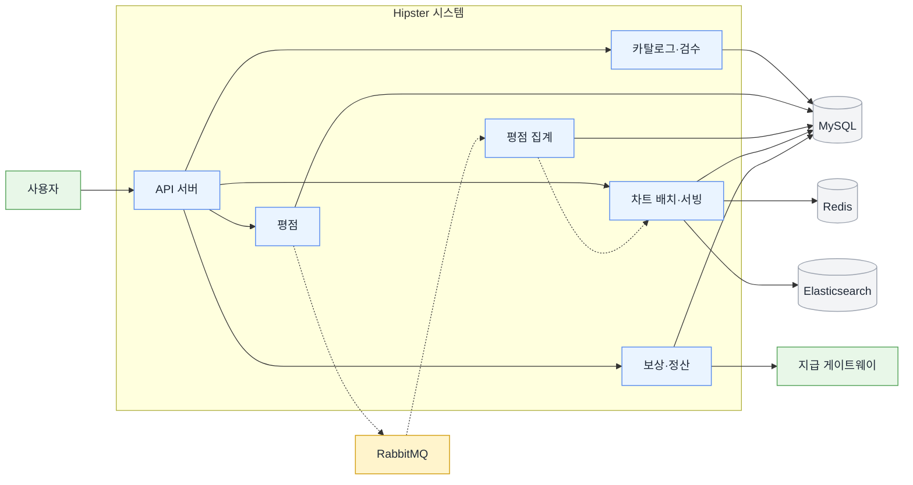
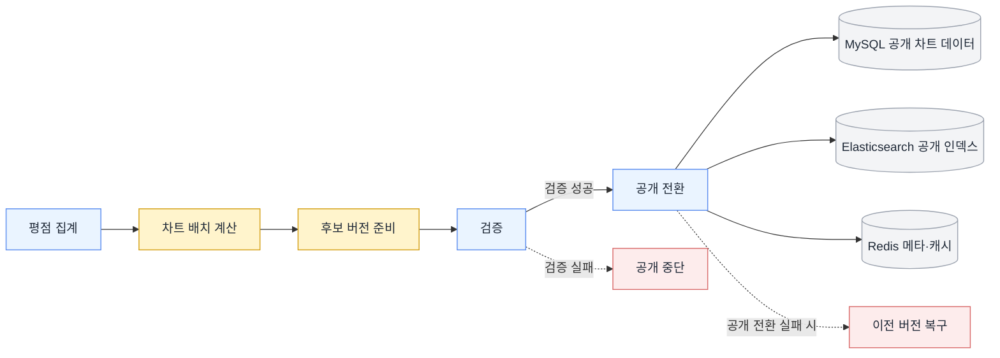
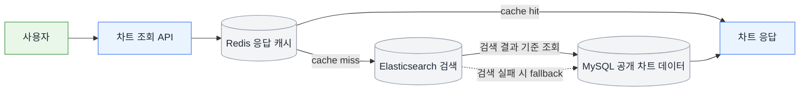
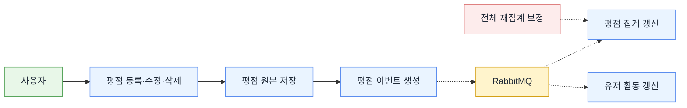
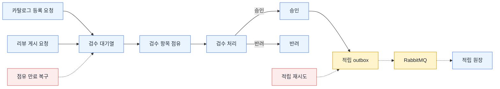
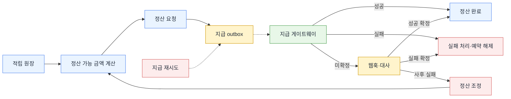
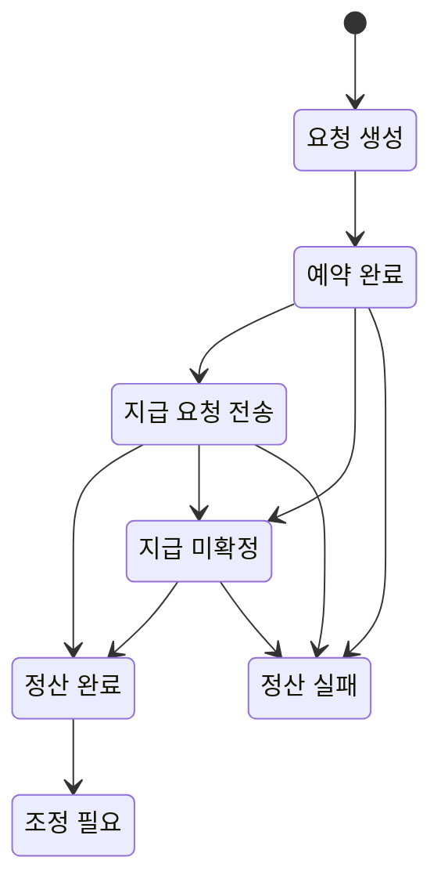

# Hipster

> 평점 원본을 집계 계층과 공개 차트 계층으로 분리하고, 차트를 `generate -> validate -> publish -> serve` 파이프라인으로 관리하는 음악 레이팅 플랫폼 백엔드입니다.  
> Redis, Elasticsearch, MySQL, `lastUpdated`가 같은 공개 기준을 따르도록 차트 공개 경계를 정리했습니다.

## 소개

- 원본 평점 `ratings`를 그대로 읽지 않고, `release_rating_summary`와 `chart_scores`로 책임을 분리했습니다.
- 차트는 배치 완료 시점이 아니라 `chart_publish_state.current_version`을 기준으로 공개 버전을 관리합니다.
- 차트 조회는 Redis 캐시, Elasticsearch 검색, MySQL 폴백, 메타데이터 경로로 나눠 병목과 부분 실패를 분리했습니다.
- 평점, 검수/적립, 정산에 같은 정합성 모델을 강요하지 않고 도메인별 실패 비용에 맞춰 다르게 설계했습니다.

## 성과

모든 수치는 로컬 환경 기준입니다.

### 차트 / 서빙

| 항목 | 조건 | Before | After |
| --- | --- | ---: | ---: |
| 차트 장르 필터 조회 | 500만 건 합성 데이터 | 65,421ms | 178.37ms |
| 차트 반복 요청 적중 경로 | 500만 건 합성 데이터 | 11,386ms | 16.73ms |
| 갱신 시각(`lastUpdated`) 조회 | 500만 건 합성 데이터 | 4,732ms | 1.00ms |
| 차트 재생성 배치 | 500만 건 집계 기준 환산 | 약 87.9분 | 약 23.9분 |

### 집계 / 쓰기

| 항목 | 조건 | Before | After |
| --- | --- | ---: | ---: |
| 평점 집계 조회 | 동일 릴리즈 1건 · 유저 10,000명 · 평점 10,000건 | 806ms | 20ms |
| 동일 릴리즈 100건 동시 등록 평균 | 동일 릴리즈에 동시 쓰기 발생 | 126ms | 12.95ms |

## 설계

### 1. 공개 차트를 만드는 경계를 분리했습니다

`ratings -> release_rating_summary -> chart_scores`로 원본, 집계, 공개 차트를 나눴습니다.  
차트는 `generate -> validate -> publish -> serve` 파이프라인으로 다루고, 공개 기준점은 `chart_publish_state.current_version` 하나로 고정했습니다.

그래서 아래를 한 기준으로 설명할 수 있습니다.

- 지금 공개된 차트 버전
- Redis 응답 캐시가 따라야 하는 버전
- Elasticsearch `alias`가 가리켜야 하는 버전
- `lastUpdated`가 의미하는 논리 시점 `logical_as_of_at`

### 2. 차트 조회를 하나의 느린 쿼리로 보지 않았습니다

차트 API는 단순 정렬 조회가 아니라 필터, 검색, 응답 조립, 메타데이터 조회가 함께 붙는 경로였습니다.  
그래서 조회를 한 번에 빠르게 만드는 대신, 역할별로 나눴습니다.

- Redis: 반복 요청 적중 경로
- Elasticsearch: 필터 + 정렬 기준으로 후보 탐색
- MySQL: 검색 실패나 인덱스 문제 시 폴백
- 메타데이터 경로: `lastUpdated` 별도 조회

이 구조로 캐시 적중, 검색 미스, 검색 장애, 메타데이터 병목을 각각 따로 설명할 수 있게 했습니다.

### 3. 도메인별로 다른 일관성 전략을 적용했습니다

평점은 결과적 일관성으로 수렴시켜도 되는 도메인이고, 적립/정산은 재계산으로 복구할 수 없는 상태를 다룹니다.  
그래서 같은 "정합성" 문제라도 경계를 다르게 잡았습니다.

- 평점 집계: `AFTER_COMMIT + RabbitMQ + Anti-Entropy`
- 검수/적립: `Outbox + 원장 멱등성`
- 정산: 요청, 예약, 미확정, 조정 기록 기반 상태 모델

## 트러블슈팅

### 1. `lastUpdated`가 실제 차트 검색보다 더 느린 병목이었습니다

Elasticsearch로 검색 경로를 분리한 뒤에도 API 전체 시간은 `4,700ms ~ 5,300ms` 수준에 머물렀습니다.  
원인은 검색이 아니라 공통 메타데이터인 `lastUpdated` 조회가 요청마다 4초대 고정 비용으로 붙고 있었기 때문이었습니다.

- 검색 단계와 메타데이터 경로를 분리했습니다.
- `lastUpdated`를 별도 조회로 빼고, 공개 버전의 논리 시점 `logical_as_of_at`를 기준으로 다시 정의했습니다.
- 그 결과 `lastUpdated` 조회는 `4,732ms -> 1.00ms`로 줄었고, 차트 장르 필터 조회도 `65,421ms -> 178.37ms`까지 내려갔습니다.

관련 문서: [차트 API 조회 경로를 캐시·검색·폴백·메타데이터로 분리해 응답 병목 줄이기](./portfolio/chart-serving.md)

### 2. 유저 가중치 변경이 배치 문제가 아니라 쓰기 증폭 문제였습니다

처음엔 유저 가중치 배치가 느리다고 봤지만, 실제 문제는 가중치 1회 변경이 과거 평점 행 재기록으로 번지는 구조였습니다.  
`ratings.weighted_score` 같은 전제를 유지하면 배치를 빨리 돌려도 원본 평점 계층에 대량 UPDATE 부담이 남습니다.

- 유저 가중치 배치의 직접 쓰기 범위를 `users.weighting_score`, `user_weight_stats`로 제한했습니다.
- 과거 평점 재기록 대신 `release_rating_summary` 재계산 경계로 넘겼습니다.
- 그 결과 전체 배치 시간은 `921,000ms -> 359,200ms`로 줄었고, 원본 평점 계층의 대량 `UPDATE`도 제거했습니다.

관련 문서: [유저 가중치 변경이 만드는 쓰기 증폭을 줄이기 위한 구조 재설계](./portfolio/user-credibility-batch.md)

## 상세 문서

### 먼저 읽을 문서

- [차트 생성·검증·공개를 분리해 공개 지표 신뢰도 지키기](./portfolio/chart-pipeline.md)
- [차트 API 조회 경로를 캐시·검색·폴백·메타데이터로 분리해 응답 병목 줄이기](./portfolio/chart-serving.md)
- [차트 재생성 배치 비용을 줄이기](./portfolio/chart-batch-performance.md)
- [평점 집계 계층을 분리하고 결과적 일관성으로 수렴시키기](./portfolio/rating-aggregation.md)

### 보조 문서

- [유저 가중치 변경이 만드는 쓰기 증폭을 줄이기 위한 구조 재설계](./portfolio/user-credibility-batch.md)
- [검수 적체와 담당 전환을 현재 상태·운영 이력·SLA로 관리하는 검수 대기열](./portfolio/moderation-queue.md)
- [승인과 적립을 분리해 보상 상태를 설명하는 적립 원장](./portfolio/reward-ledger.md)
- [외부 지급을 설명 가능한 상태로 다루는 정산 모델](./portfolio/settlement-pay-and-reconcile.md)

## 기술 스택

Java 17 · Spring Boot 3.2.3 · Spring Data JPA · Querydsl · Spring Batch · MySQL · Redis · Elasticsearch · RabbitMQ · Prometheus · Grafana · Docker

전체 아키텍처 보기

## 📐 Architecture Overview

상세 흐름 보기

## 🔍 Flow Diagrams

### 차트 흐름

#### 차트 배치·공개

#### 차트 조회·서빙

### 평점 흐름

### 승인 · 적립 · 정산 흐름

#### 검수·승인·적립

#### 정산 요청·지급·보정

#### 정산 상태 전이

