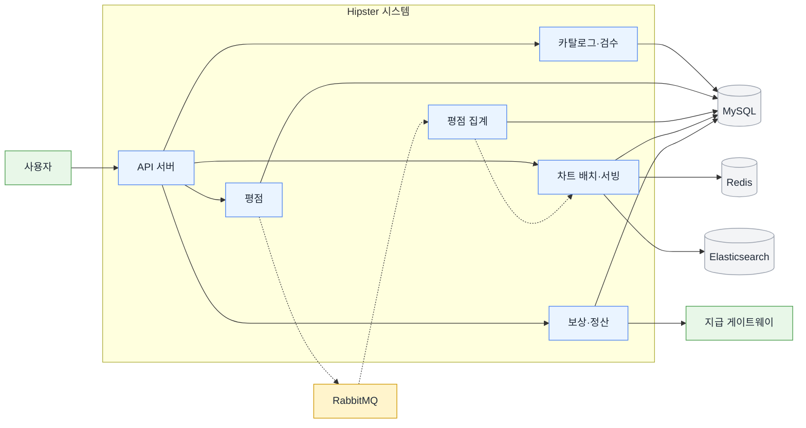
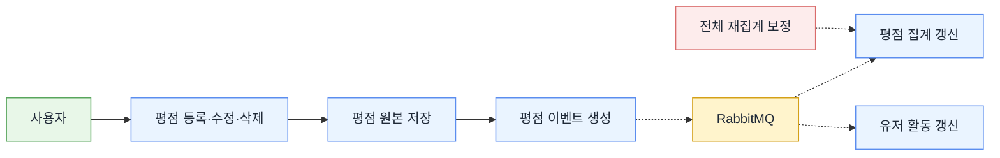
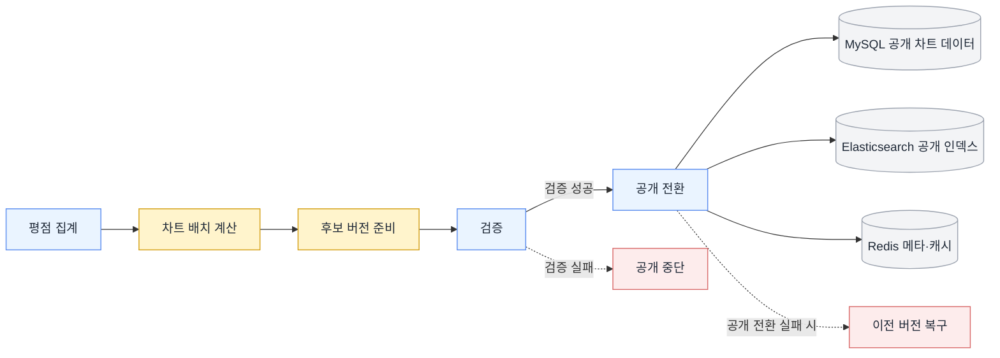
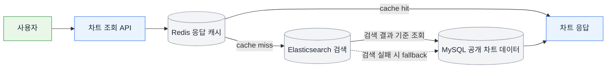
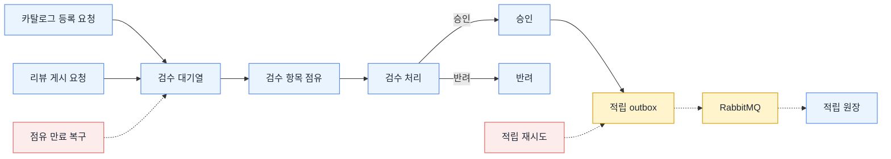
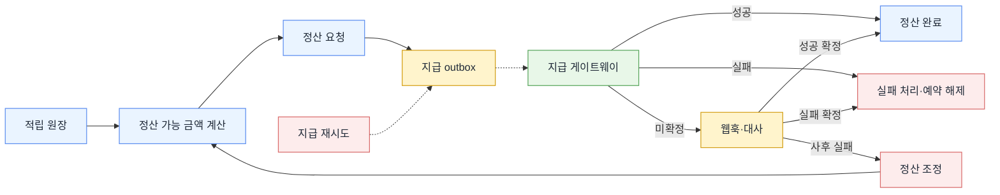
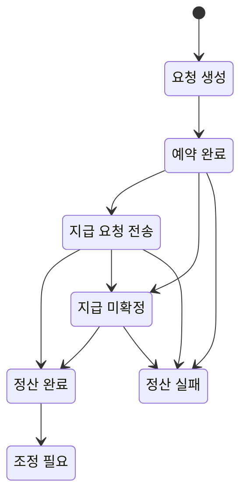

# Hipster

> 사용자 평점을 집계해 차트를 제공하고, 사용자 기여는 검수와 보상 흐름으로 관리하는 음악 레이팅 플랫폼 백엔드입니다. 조회 성능이 중요한 영역은 집계·캐시·검색 경로로 분리하고, 보상과 정산은 상태를 끝까지 설명할 수 있는 구조로 설계했습니다.

## 🛠 Tech Stack

Java 17 · Spring Boot 3.2.3 · Spring Data JPA · Querydsl · Spring Batch · MySQL · Redis · Elasticsearch · RabbitMQ · Prometheus · Grafana · Docker

## 📐 Architecture Overview

## ⚡ Key Achievements

### 조회 / 응답 성능

모든 수치는 로컬 환경 기준입니다.  

| 항목 | 데이터 규모 · 조건 | Before | After |
|---|---|---:|---:|
| 차트 조회 | 500만 건 합성 데이터 · 장르 조건 조회 | 65,421ms | 178.37ms |
| 차트 조회 | 500만 건 합성 데이터 · 반복 요청 적중 경로 | 11,386ms | 16.73ms |
| 평점 집계 조회 | 동일 릴리즈 1건 · 유저 10,000명 · 평점 10,000건 | 806ms | 20ms |
| 평점 등록 응답 | 동일 릴리즈 100건 동시 등록 평균 | 126ms | 12.95ms |

### 배치 / 처리 성능

모든 수치는 로컬 환경 기준입니다.  

| 항목 | 데이터 규모 · 조건 | Before | After |
|---|---|---:|---:|
| 차트 재생성 배치 | 500만 건 집계 기준 환산 | 약 87.9분 | 약 23.9분 |
| 유저 가중치 배치 | 유저 50,000명 · 평점 5,000,000건 합성 데이터 | 921,000ms | 359,200ms |

### 정합성 / 운영 설계

- **차트 공개 파이프라인 분리**: 생성, 검증, 공개, 서빙을 나눠 Redis 공개 버전, 갱신 시각, Elasticsearch alias, API 응답이 같은 공개 기준을 따르도록 만들었습니다.
- **검수 대기열 운영화**: 담당 전환, 점유 회수, SLA 기준을 응답과 메트릭에 함께 노출해 backlog를 시스템 안에서 읽을 수 있게 만들었습니다.
- **적립 원장 분리**: 승인과 적립을 분리하고, 중복 적립, 정책 차단, 취소를 원장 기록으로 설명할 수 있게 만들었습니다.
- **정산 상태 모델링**: 총 적립 잔액과 정산 가능 금액을 분리하고, 타임아웃과 늦은 실패를 미확정과 조정 기록으로 추적할 수 있게 만들었습니다.

## 📚 Documents

| 문서 | 핵심 주제 |
|---|---|
| [유저 가중치 변경이 만드는 쓰기 증폭을 줄이기 위한 구조 재설계](./portfolio/user-credibility-batch.md) | Spring Batch / write path / 유저 가중치 |
| [평점 집계 계층을 분리하고 결과적 일관성으로 수렴시키기](./portfolio/rating-aggregation.md) | rating summary / RabbitMQ / Anti-Entropy |
| [차트 재생성 배치 비용을 줄이기](./portfolio/chart-batch-performance.md) | chart batch / stage write / ES source fetch |
| [차트 생성·검증·공개를 분리해 공개 지표 신뢰도 지키기](./portfolio/chart-pipeline.md) | publish pipeline / 공개 버전 / rollback |
| [차트 API 조회 경로를 캐시·검색·폴백·메타데이터로 분리해 응답 병목 줄이기](./portfolio/chart-serving.md) | Redis / Elasticsearch / MySQL fallback |
| [검수 적체와 담당 전환을 현재 상태·운영 이력·SLA로 관리하는 검수 대기열](./portfolio/moderation-queue.md) | moderation queue / backlog / SLA |
| [승인과 적립을 분리해 보상 상태를 설명하는 적립 원장](./portfolio/reward-ledger.md) | outbox / ledger / idempotency |
| [외부 지급을 설명 가능한 상태로 다루는 정산 모델](./portfolio/settlement-pay-and-reconcile.md) | payout / reconcile / state transition |

## 🔍 Flow Diagrams

### 평점 흐름

### 차트 흐름

#### 차트 배치·공개

#### 차트 조회·서빙

### 승인 · 적립 · 정산 흐름

#### 검수·승인·적립

#### 정산 요청·지급·보정

#### 정산 상태 전이

